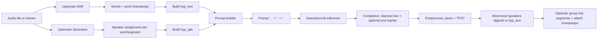

# Using DiarizationLM-8B Fisher-v2 (Llama 3 8B) in Python

Suggested filename: `diarizationlm-8b-fisher-v2-python-guide_2026-04-05.md`  
Download: [Download the Markdown](sandbox:/mnt/data/diarizationlm-8b-fisher-v2-python-guide_2026-04-05.md)

## Executive summary

DiarizationLM is a framework that uses a large language model (LLM) to **post-process** speaker diarization results, consuming a compact text representation of an ASR transcript with inline speaker tags and emitting an improved speaker-attributed transcript. It is explicitly designed to operate *after* upstream ASR + diarization without retraining those upstream components. citeturn33view0turn10academia22

The Python “happy path” is:

- represent the upstream ASR words + diarization labels as `hyp_text` + `hyp_spk` (space-separated strings with a 1:1 word↔speaker mapping),  
- build a prompt like `"<speaker:1> … <speaker:2> … --> "`,  
- run causal-LM generation,  
- postprocess the completion by (a) stripping end markers if present, (b) parsing the predicted speaker stream, and (c) transferring those speakers onto the original recognized transcript with **Transcript-Preserving Speaker Transfer (TPST)** to minimize text drift. citeturn18view0turn31view0turn16view0

Operationally, you should design around constraints documented by the authors and model artifacts: prompts were trained with a 6000-character length limit (including the `" --> "` suffix) and a 4096-token max sequence length; the reference parser expects numeric speaker IDs and treats out-of-range or malformed speaker tokens as invalid; the hosted model repo is large (~29.5 GB) and includes BF16 `safetensors` shards plus GGUF quantizations. citeturn2view0turn17view1turn34view0

Primary sources and “link targets” (URLs are placed in a code block for easy copy/paste):

```text
Model (Hugging Face): https://huggingface.co/google/DiarizationLM-8b-Fisher-v2
Reference utilities + tools (GitHub): https://github.com/google/speaker-id/tree/master/DiarizationLM
Paper (arXiv): https://arxiv.org/abs/2401.03506

Meta Llama 3 license: https://www.llama.com/llama3/license/
Meta Llama 3 announcement: https://ai.meta.com/blog/meta-llama-3/

Transformers generation docs: https://huggingface.co/docs/transformers/en/main_classes/text_generation
Transformers bitsandbytes quantization docs: https://huggingface.co/docs/transformers/quantization/bitsandbytes
Hugging Face Hub auth docs: https://huggingface.co/docs/huggingface_hub/en/quick-start
PyTorch install selector: https://pytorch.org/get-started/locally/
```

## What the model does and where it fits in a pipeline

As described by entity["company","Google","technology company"] researchers, DiarizationLM is a post-processing framework: it takes the outputs of an ASR system and a diarization system, encodes them into a compact textual prompt, optionally uses a fine-tuned LLM, and then uses the LLM output as refined diarization results. The key motivation is that this can be applied to existing systems “without retraining existing components.” citeturn33view0turn10academia22

The released DiarizationLM-8B Fisher-v2 model is hosted on entity["company","Hugging Face","ai model platform"], where the repository also reports the model’s license as `llama3`. This corresponds to the entity["company","Meta","tech company"] Llama 3 Community License; review the license terms before redistribution or commercial deployment. citeturn34view0turn42search0

Because the LLM operates on text, **audio format details** (codec, sample rate, channel count) are upstream responsibilities. The DiarizationLM prompt itself does not contain audio bytes; it contains words and speaker tags. Consequently, timestamps are not *generated* by DiarizationLM; if you need “who spoke when,” you must preserve timestamps from upstream ASR/diarization and join them with the final speaker labels after postprocessing. citeturn33view0turn10academia22

A practical end-to-end flow is:



## Data preparation and exact input formats

The authors provide a `diarizationlm` Python package and scripts under the DiarizationLM directory of the entity["company","GitHub","code hosting platform"] repository. The package definition and README describe: (a) the JSON-based utterance format, (b) conversions between representations, and (c) TPST alignment utilities. citeturn12view0turn21view0

**Internal JSON storage format (utterances).** The tooling assumes JSON with a top-level `"utterances"` list, where each utterance contains string fields like `"utterance_id"`, `"hyp_text"`, `"hyp_spk"`, and optionally derived/debug fields like `"hyp_diarized_text"`; reference (“ref_*”) fields follow the same pattern. citeturn12view0turn38view0turn39view0

**Exact sequence representation (`*_text` + `*_spk`).** The most important invariant is that word and speaker sequences must match in length. TPST explicitly checks and throws a `ValueError` if `len(text.split()) != len(spk.split())` for either source or target. citeturn16view0turn16view1

**Exact diarized-text representation (what the LLM sees).** The diarized text is built by inserting a speaker token whenever the speaker changes. The token format is parameterized by `PromptOptions`:

- `speaker_prefix` default: `"<speaker:"`  
- `speaker_suffix` default: `">"`  
- `prompt_suffix` default: `" --> "` citeturn18view0

The converter `create_diarized_text()` emits `speaker_prefix + speaker_id + speaker_suffix` on speaker changes and joins the resulting stream with spaces. citeturn16view1turn17view1

**Speaker label constraints during parsing.** The reference parser `extract_text_and_spk()` treats tokens starting with `speaker_prefix` as speaker markers, extracts the numeric ID, and validates it as an integer. By default, it considers IDs outside 1..10 (and other malformed speaker markers) “unexpected” and skips them, continuing with the previous speaker. citeturn17view1

**Prompt and completion suffixes used for Llama 3 training.** The Llama 3 fine-tuning config sets `PROMPT_SUFFIX = " --> "` and `COMPLETION_SUFFIX = " [eod]"`, and also uses 6000-character emit limits and a 4096-token sequence length. citeturn25view0

**Tokenization and length constraints.** Two different constraints matter:

- the authors’ training configuration uses a 6000-character prompt length limit and a 4096-token max sequence length, citeturn2view0turn25view0  
- the hosted model’s generation configuration sets `max_length = 4096` and sampling defaults. citeturn35view0

Because characters and tokens do not map 1:1, production code should enforce both (e.g., check token lengths with the tokenizer and segment if needed). The provided `JsonUtteranceReader` segments prompts/targets recursively based on estimated prompt/target lengths and appends the configured suffixes. citeturn17view3turn29view2

**Input-format comparison table.**

| Format | Exact structure | Used by | Key benefit | Key constraint |
|---|---|---|---|---|
| Word + speaker sequences (“sequence representation”) | `text: "w1 w2 …"` and `spk: "s1 s2 …"` with equal lengths | TPST + JSON | Easy to join with timestamps later | TPST enforces equal-length invariant citeturn16view0 |
| Diarized text (“pure text representation”) | `"<speaker:1> w1 w2 <speaker:2> w3 …"` | LLM prompt/target | Compact; matches model training | Parser expects numeric speakers; invalid markers skipped citeturn17view1turn18view0 |
| Prompt-completion pair | `prompt = diarized_text + " --> "`; `target = diarized_text + " [eod]"` | Training + some inference setups | Matches released training config | Suffix spacing and end marker matter for parsers citeturn25view0turn31view0 |

## Dependencies and setup

**Minimum packages (inference).** The model card instructs installing `transformers` and `diarizationlm`. citeturn2view0

**Python version.** The published package metadata for diarizationlm indicates Python 3 support (classifier `Python :: 3`), but does not declare a stricter `python_requires` in the repository’s setup script; treat the minimum Python 3.x version as *unspecified* in primary sources and use a modern Python 3 version consistent with your PyTorch/Transformers stack. citeturn22view1turn21view2

**DiarizationLM package dependencies.** The repository’s `requirements.txt` lists scientific packages and utilities (numpy, numba, scipy, tensorflow-text, absl-py, datasets, etc.) and also includes an optional dependency on entity["company","OpenAI","ai company"]’s SDK because the same repo contains scripts for OpenAI-model fine-tuning/inference. This dependency is not required for running the Llama 3 model locally via Transformers. citeturn23view0turn12view0

**PyTorch + CUDA.** For GPU inference you generally want a CUDA-capable GPU (commonly entity["company","NVIDIA","gpu company"] hardware) and a matching entity["organization","PyTorch","ml framework"] build with CUDA support. The official install selector describes how to choose CPU vs CUDA and provides the exact pip/conda command for your OS and compute platform. citeturn32search3

**Weights source and disk footprint.** The model is hosted on Hugging Face and the “Files and versions” view reports a repository size of ~29.5 GB and multiple `safetensors` shards; GGUF quantizations are also present. citeturn34view0

**Authentication to Hugging Face (when needed).** If you hit authentication/gating or need to access the Hub in a controlled environment, the Hub docs describe authenticating via `HF_TOKEN` environment variable (useful for scripts and CI) or logging in via the `hf` CLI. citeturn32search10turn32search6

**Dependencies comparison table.**

| Layer | Required components | Why / source |
|---|---|---|
| Core utilities | `pip install diarizationlm` | Repo README and install notes. citeturn12view0turn21view0 |
| Model inference | `transformers` + PyTorch | Model card’s usage is Transformers-based. citeturn2view0 |
| GPU acceleration | CUDA-capable system + PyTorch CUDA build | Official PyTorch install guidance. citeturn32search3 |
| Optional VRAM reduction | `bitsandbytes` quantization | Transformers docs support 8-bit/4-bit loading via BitsAndBytesConfig and describe memory impact. citeturn32search1turn32search5 |
| Optional Hub auth | `HF_TOKEN` or `hf auth login` | Hub quickstart and CLI docs. citeturn32search10turn32search6 |

## Hyperparameters and configurable knobs

This section focuses on “knobs” that appear in primary sources: PromptOptions + training configs + generation_config + Transformers docs.

**PromptOptions (format + segmentation).** `PromptOptions` defines defaults used by prompt builders:

- `emit_input_length = 896`, `emit_target_length = 896` (defaults)  
- `prompt_suffix = " --> "`  
- `completion_suffix = ""` (default; configured per task)  
- `speaker_prefix = "<speaker:"`, `speaker_suffix = ">"` citeturn18view0

For the released Llama 3 configuration, the recommended values are those used during fine-tuning: `EMIT_INPUT_LENGTH = 6000`, `EMIT_TARGET_LENGTH = 6000`, `PROMPT_SUFFIX = " --> "`, and `COMPLETION_SUFFIX = " [eod]"`. citeturn25view0

**Inference-time decoding defaults (from generation_config.json).** The model repo provides an explicit generation config: `do_sample=true`, `temperature=0.6`, `top_p=0.9`, and `max_length=4096` (plus BOS/EOS IDs and a Transformers version). citeturn35view0

**Determinism vs sampling.** Transformers documents `do_sample` as the switch controlling whether generation uses sampling or greedy decoding (and explicitly warns that `temperature` has no effect unless `do_sample=True`). For diarization post-processing, greedy decoding (`do_sample=False`) is often preferred for reproducibility, though the repo’s default generation config is sampling-based. citeturn32search32turn32search4turn35view0

**Length controls.** Transformers generation docs recommend using `max_new_tokens` when you want to cap only the output length (independent of prompt length), and explain that `max_length` corresponds to prompt+output length. This matters for call-length transcripts because a long prompt can consume most of the 4096-token budget. citeturn32search12turn32search0turn35view0

**KV cache tradeoff.** Transformers describes KV caching as a mechanism to reuse attention computations for speed, and documents that different cache strategies trade memory vs speed. citeturn36search30turn36search0

**Quantization tradeoff.** Transformers’ bitsandbytes docs show how to quantize via BitsAndBytesConfig and state that 8-bit quantization can significantly reduce memory usage (and recommend `device_map="auto"` for large models). citeturn32search1

**Fine-tuning hyperparameters (reference scripts).** The Llama 3 Unsloth configuration and training script provide concrete hyperparameters used for this model family, including LoRA rank 256, max sequence length 4096, and training arguments like batch size 16 and learning rate 3e-5. citeturn25view0turn27view0

**Training sample size and batching (as reported).** The model card reports that the Fisher-v2 LoRA fine-tune used 51,063 prompt–completion pairs; with batch size 16 it was trained for 28,800 steps (about 9 epochs), and it notes a single-A100-80GB training run time on the order of days. Use these values as an evidence-backed “known good” baseline if you are reproducing training or estimating compute. citeturn2view0

**Hyperparameter table.**

| Category | Parameter | Required? | Reference default / value | Sources |
|---|---:|:---:|---:|---|
| Speaker token format | `speaker_prefix`, `speaker_suffix` | Yes | `"<speaker:"`, `">"` | citeturn18view0turn17view1 |
| Prompt delimiter | `prompt_suffix` | Yes | `" --> "` | citeturn18view0turn25view0 |
| Completion end marker | `completion_suffix` | Recommended | `" [eod]"` | citeturn25view0turn31view0 |
| Segmentation | `emit_input_length`, `emit_target_length` | Optional | 896 / 6000 | citeturn18view0turn25view0 |
| Decoding | `do_sample` | Optional | true (repo default) | citeturn35view0turn32search32 |
| Decoding | `temperature`, `top_p` | Optional | 0.6 / 0.9 | citeturn35view0turn32search4 |
| Length | `max_length` | Optional | 4096 | citeturn35view0turn32search12 |
| Fine-tune | LoRA rank `r` | Optional | 256 | citeturn25view0turn27view0 |
| Fine-tune | LR / batch size | Optional | 3e-5 / 16 | citeturn27view0 |

## Output format and postprocessing

**Raw LLM output.** In the Transformers usage pattern, `generate()` returns token IDs; you decode only the completion portion (tokens after the prompt length). The model card’s example then uses a transfer utility to map the completion’s speaker labels back onto the hypothesis transcript text. citeturn2view0turn16view3

**Reference postprocessing behavior.** The repo provides an utterance-level postprocessing function that:

- optionally truncates each completion at the configured completion suffix,  
- concatenates segmented completions,  
- parses merged completion text into `(llm_text, llm_spk)` via `extract_text_and_spk`,  
- applies TPST to transfer those speakers onto the hypothesis (`hyp_text`, `hyp_spk`) to constrain transcript drift. citeturn31view0

**A practical JSON output schema.** The official utilities are string-based, but a common downstream representation is a JSON structure containing word-level items and grouped segments. Below is a *recommended* schema (proposed) that preserves timestamps from upstream ASR while adopting DiarizationLM’s final speaker labels per word:

```json
{
  "utterance_id": "example",
  "words": [
    {"w": "hello", "t0": 12.34, "t1": 12.58, "speaker": "1"},
    {"w": "there", "t0": 12.59, "t1": 12.80, "speaker": "1"},
    {"w": "yes",   "t0": 13.10, "t1": 13.20, "speaker": "2"}
  ],
  "segments": [
    {"speaker": "1", "t0": 12.34, "t1": 12.80, "text": "hello there"},
    {"speaker": "2", "t0": 13.10, "t1": 13.20, "text": "yes"}
  ]
}
```

This schema is not prescribed by the repo; it follows directly from the repo’s word-level speaker outputs and the paper’s framing that the LLM is a post-processor on ASR/diarization outputs. citeturn33view0turn31view0

**Confidence scores.** DiarizationLM’s textual output does not include calibrated diarization confidences. If you need a confidence proxy, Transformers can emit token-level score tensors if you call `generate()` with `return_dict_in_generate=True` and `output_scores=True`; the generation docs mention these parameters and the internal generation utilities describe generation outputs with `sequences` and `scores`. citeturn40search1turn40search0

## End-to-end Python examples

These examples use only: Transformers for inference plus `diarizationlm.utils` for prompt construction and TPST-based postprocessing.

**Special tokens note.** The model repo’s `special_tokens_map.json` defines `<|begin_of_text|>` and `<|end_of_text|>` as BOS/EOS tokens and defines a dedicated `pad_token` content (`<|reserved_special_token_250|>`). This matters when batching variable-length prompts. citeturn41view0

**Minimal single-prompt inference.**

```python
from transformers import AutoTokenizer, LlamaForCausalLM
from diarizationlm import utils

MODEL_ID = "google/DiarizationLM-8b-Fisher-v2"

hypothesis = (
    "<speaker:1> Hello, how are you doing "
    "<speaker:2> today? I am doing well. What about "
    "<speaker:1> you? I'm doing well, too. Thank you."
)
prompt = hypothesis + " --> "

tokenizer = AutoTokenizer.from_pretrained(MODEL_ID)
model = LlamaForCausalLM.from_pretrained(MODEL_ID, device_map="cuda")  # or "cpu"

inputs = tokenizer([prompt], return_tensors="pt").to(model.device)

#Using the repo default sampling config is possible, but greedy decoding is reproducible.
outputs = model.generate(
    **inputs,
    do_sample=False,
    max_new_tokens=512,
)

completion = tokenizer.batch_decode(
    outputs[:, inputs.input_ids.shape[1]:],
    skip_special_tokens=True,
)[0]

#Transfer completion speaker IDs onto the hypothesis transcript text.
transferred = utils.transfer_llm_completion(
    llm_completion=completion,
    hyp=hypothesis,
    po=utils.PromptOptions(completion_suffix=" [eod]"),
)

print("Completion:\n", completion)
print("\nTransferred diarized text:\n", transferred)
```

The use of `" --> "` and the idea of transferring completion speakers back onto the hypothesis are directly supported by the reference PromptOptions and transfer utilities. citeturn18view0turn16view3turn25view0

**Long utterance segmentation + utterance-level merge.**

```python
from transformers import AutoTokenizer, LlamaForCausalLM
from diarizationlm import utils

MODEL_ID = "google/DiarizationLM-8b-Fisher-v2"

utt = {
    "utterance_id": "utt1",
    "hyp_text": "hello good morning how are you",
    "hyp_spk":  "1 1 1 2 2 2",
}

po = utils.PromptOptions(
    emit_input_length=6000,
    emit_target_length=6000,
    prompt_suffix=" --> ",
    completion_suffix=" [eod]",
)

prompts = utils.generate_prompts(
    utt,
    po=po,
    text_field="hyp_text",
    input_speaker_field="hyp_spk",
)

tokenizer = AutoTokenizer.from_pretrained(MODEL_ID)
model = LlamaForCausalLM.from_pretrained(MODEL_ID, device_map="cuda")

completions = []
for prompt in prompts:
    inputs = tokenizer([prompt], return_tensors="pt").to(model.device)
    out = model.generate(**inputs, do_sample=False, max_new_tokens=1024)
    comp = tokenizer.batch_decode(out[:, inputs.input_ids.shape[1]:], skip_special_tokens=True)[0]
    completions.append(comp)

utt_post = dict(utt)
utt_post["completions"] = completions

utils.postprocess_completions_for_utt(
    utt_post,
    llm_text_field="llm_text",
    llm_speaker_field="llm_spk",
    transfered_llm_speaker_field="hyp_spk_llm",
    hyp_text_field="hyp_text",
    hyp_spk_field="hyp_spk",
    po=po,
)

print("Transferred speakers per word:\n", utt_post["hyp_spk_llm"])
```

This mirrors the repository’s segmented-completion merge logic and TPST transfer step, which are the recommended way to handle long transcripts where the LLM may alter text slightly. citeturn31view0turn30view1turn16view0

**Scoring tokens as a confidence proxy.**

```python
import torch
from transformers import AutoTokenizer, LlamaForCausalLM

MODEL_ID = "google/DiarizationLM-8b-Fisher-v2"
prompt = "<speaker:1> hello <speaker:2> hi --> "

tokenizer = AutoTokenizer.from_pretrained(MODEL_ID)
model = LlamaForCausalLM.from_pretrained(MODEL_ID, device_map="cuda")

inputs = tokenizer([prompt], return_tensors="pt").to(model.device)

gen = model.generate(
    **inputs,
    do_sample=False,
    max_new_tokens=64,
    return_dict_in_generate=True,
    output_scores=True,
)

#gen.scores is a tuple of logits tensors for each generated step.
#You can convert logits to probabilities via softmax if needed.
step0_logits = gen.scores[0][0]
step0_probs = torch.softmax(step0_logits, dim=-1)
```

Transformers documents `return_dict_in_generate=True` and `output_scores=True` as the mechanism to return generation score tensors (useful, for example, when stopping criteria depend on scores). citeturn40search1turn40search0

**Preprocessing → inference → postprocessing flowchart.**

```mermaid
flowchart TD
  P1[Input: hyp_text + hyp_spk] --> P2[Prompt build: <speaker:N> stream]
  P2 --> P3[Append prompt_suffix: ' --> ']
  P3 --> I1[Tokenizer + model.generate]
  I1 --> I2[Decode completion tokens]
  I2 --> O1[Optional: truncate completion_suffix ' [eod]']
  O1 --> O2[extract_text_and_spk -> llm_text + llm_spk]
  O2 --> O3[TPST transfer onto hyp_text]
  O3 --> O4[Output: hyp_spk_llm (+ optional diarized text)]
```

This flow uses the same suffix conventions and postprocessing functions that are implemented and documented in the open-source DiarizationLM utilities. citeturn18view0turn31view0turn25view0